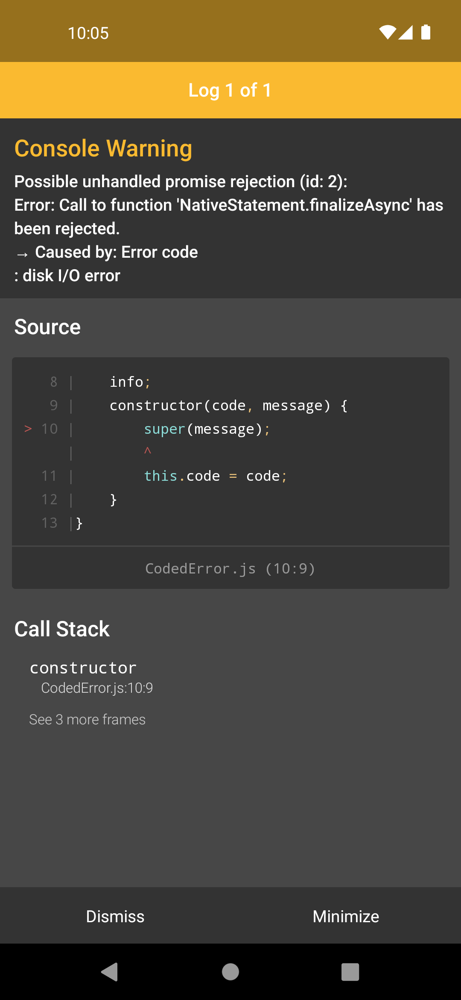

# expo-sqlite bug

This is a minimal reproducible example of a bug in the `expo-sqlite` package.

## Bug description

Executing complex queries results in a SQLite error: `Call to function 'NativeStatement.finalizeAsync' has been rejected. → Caused by: Error code : disk I/0 error`

A sample query is shown in App.tsx.

## How to reproduce the bug with this example

1. Clone this repository
2. Run `npm install`
3. Run `npm run android`
4. Open the app and press the `Execute` button

This is the expected error:

